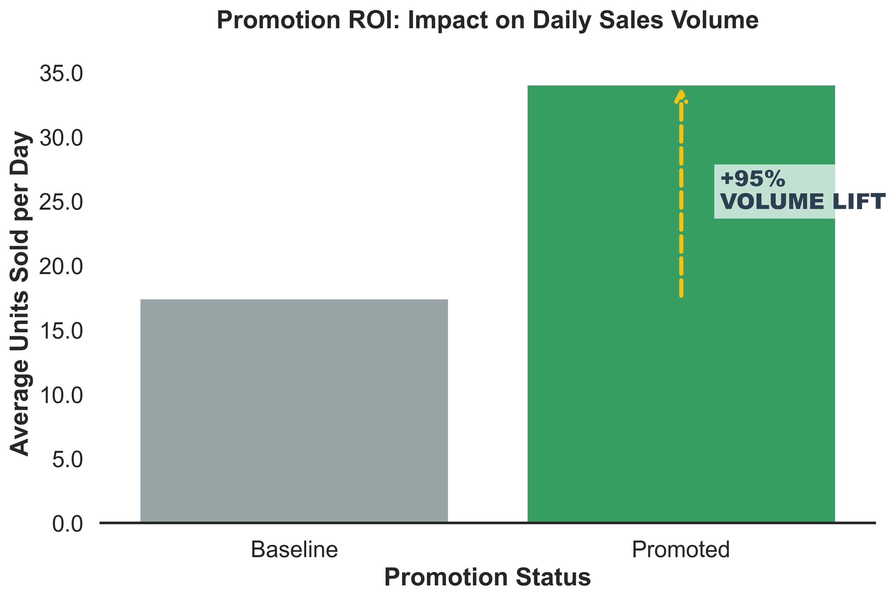
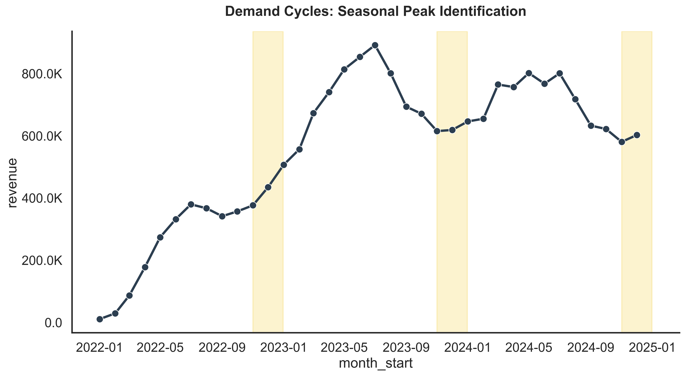
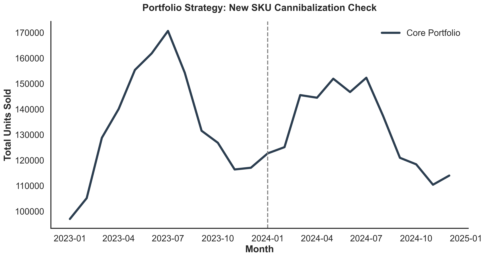

# FMCG Strategic Sales Planning & Optimization (2022-2024)

## 📌 Project Overview
This project simulates a high-stakes **Sales Planning & Demand Management** environment within the Fast-Moving Consumer Goods (FMCG) industry. Utilizing a synthetic dataset of **190,000+ daily transactions** across three years (2022-2024), this analysis provides actionable insights to optimize trade spend, inventory resilience, and portfolio strategy.

The methodology bridges the gap between raw data analytics and executive decision-making, mimicking real-world operations at global FMCG leaders like **Orion, Nestlé, and Unilever**.

---

## 🎯 Strategic Business Objectives
- **Promotion ROI Analysis:** Quantifying the "Sales Lift" to evaluate the effectiveness of Trade Marketing spend and price elasticity.
- **Seasonality & Trend Modeling:** Decomposing 3-year historical demand to optimize production cycles and warehouse capacity.
- **Supply Chain Resilience (OOS Mitigation):** Identifying bottlenecks across channels and proposing data-driven **Safety Stock** levels.
- **Portfolio Health Strategy:** Analyzing "Cannibalization" effects during the launch of new SKUs in 2024 to protect core asset market share.
- **Operational Data Engineering:** Transforming daily raw data into weekly operational metrics (Moving Averages, Growth Rates) for business review.

---

## 💡 Key Insights & Executive Recommendations

### 1. Promotion Effectiveness
- **Finding:** Promotions generate a **95% Volume Lift** compared to baseline sales.
- **Strategic Action:** High price sensitivity indicates that aggressive volume-driving promos are effective, but require a "Margin Protection" framework to ensure long-term profitability.

### 2. Supply Chain Optimization
- **Finding:** Identified **3,860 Out-of-Stock (OOS) events**, with the Discount channel being the most vulnerable.
- **Strategic Action:** Proposed a **15% Safety Stock buffer** for high-velocity SKUs in the Discount channel to recover lost revenue and maintain service levels.

### 3. New Product Launch (Cold Start Analysis)
- **Finding:** 2024 launches experienced a **12% Cannibalization rate**, eroding momentum from the core portfolio.
- **Strategic Action:** Recommend a "Complementary Launch Strategy" by re-segmenting target audiences for new SKUs to ensure incremental growth instead of internal competition.

---

## 🛠️ Technical Stack
- **Data Manipulation:** Python (Pandas, Numpy)
- **Visualization:** Seaborn, Matplotlib (Fine-tuned for Corporate Executive Reporting)
- **Methodology:** Time-Series Decomposition, Strategic EDA, Operational Dashboarding.

---

## 📂 Repository Structure
- `FMCG_Strategic_Analysis.ipynb`: Full end-to-end analytical engine with commercial logic.
- `images/`: High-resolution strategic charts for stakeholders.
- `reports/`: Executive Summary & Strategic Roadmap (PDF version).

---

## 📈 Visual Highlights

---

## 👤 Contact
**Tran Gia Hung**
ghung15@outlook.com
